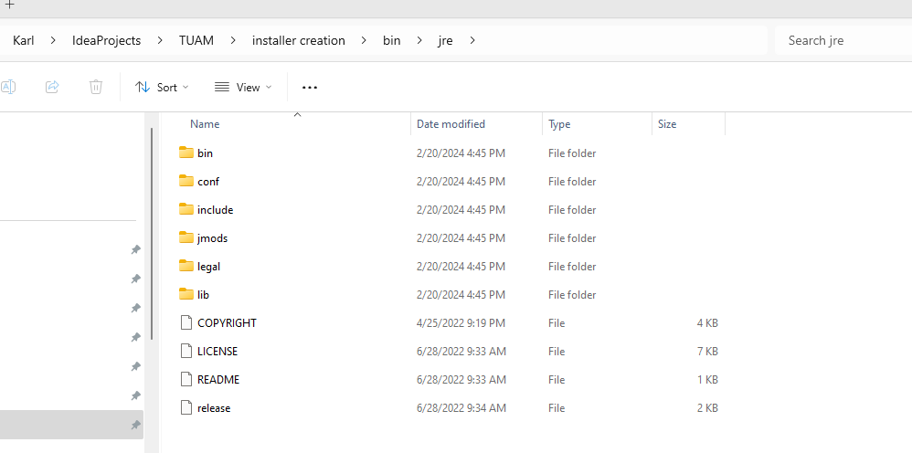
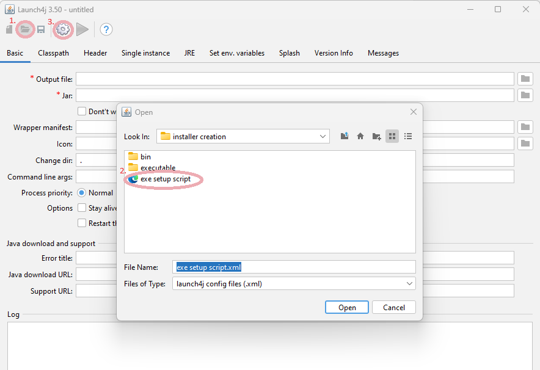
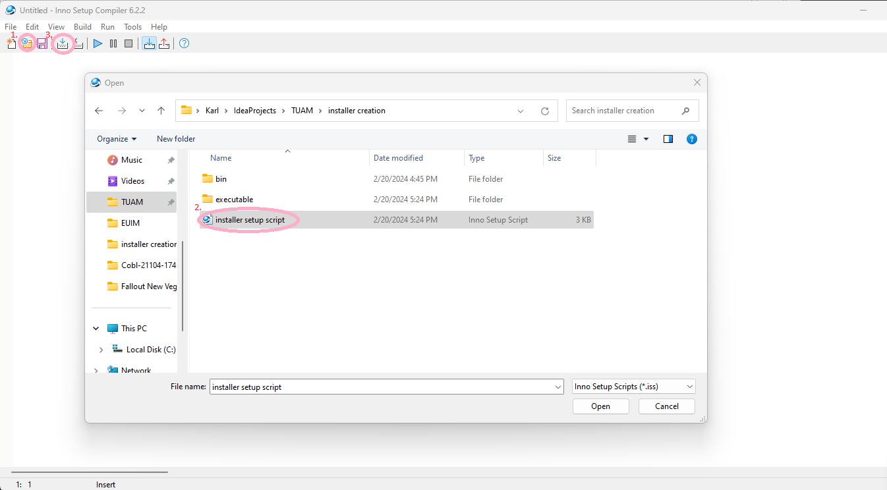

# Edit texts guide
To view the actual changes made inside the application either compile the application using source code or create an installer by following the Installer creation guide.

## Setting up the project environment developers machine [Cloning official guide video](https://www.jetbrains.com/guide/java/tips/clone-project-from-github/)
   * Download and install [Intellij Idea Community edition](https://www.jetbrains.com/idea/download/?section=windows) or some other IDE, this guide is for Intellij idea community edition
   * Find the repository where the code is located at, and get the url for cloning for example currently on github: https://github.com/karl1245/EUIM.git
   * Open Intellij installed application and finish the inital configuration
   * Click "Get from VCS" in the Intellij Welcome screen
   * If prompted with red "Git is not installed message" click the blue "Download and install" button and follow instructions
   * Paste the github (or whichever git management) URL in the url section
   * Press the clone button
   * When prompted login to github or any other git managing tool with your account
   * When prompted, Trust the project
   * The project opens
## Changing i18n file translations
   * `en.json` and `et.json` files are located at `frontend/src/assets/i18n`
   * English translations are located in `en.json` file
   * Estonian translations are located in `et.json` file
   * Translation keys must match between files
     * For example the key `deleteProjectModal.title` must both be in `en.json` and `et.json` file for it to be used correctly
## Changing database file translations
   * Database data files are located at `backend/src/main/resources/db/migration/data`
   * When making data changes you must make a new file into this folder
     * The naming of the new file must follow the logic of the files previously in the folder
     * Format: `V0_YEAR_MONTH_DAY_HOUR_MINUTE__meaningful_description_of_data_changes.sql`
   * You can avoid writing SQL manually
     * You can view the compiled database if you have installed and run the application OR started the application from source code
     * For example I have installed the application using the installer
     * I have also installed some database visual manager too like [DBeaver](https://dbeaver.io/download/) which this guide is for
     * In Dbeaver i create new connection [Official guide](https://dbeaver.com/docs/dbeaver/Create-Connection/)
     * In the new connection setup i choose SQLite
     * And when prompted i will open the database file. Example database path: `"C:\Users\Username\AppData\Local\Programs\EbA\database.db"`
     * This will create a new database in the right side Menu
     * Open this database
     * When prompted install additional drivers
     * Now you can see the database in its whole
     * When right clicking and pressing "View Data" on a table you can see the data in the database
     * You can also make changes directly in DBeaver user interface
       * When changes have been there is a green "Save" button at the bottom
       * Next to the button is a dropdown menu button
       * When clicking that dropdown menu button there is the option to "Generate Script"
       * You can take copy information generated to the data change file to avoid manually creating SQL scripts
## How to commit changes
   * You must both commit and push changes [Intellij official guide](https://www.jetbrains.com/help/idea/commit-and-push-changes.html#commit)
   * Essentially you can press CTRL + K and the commit window will open
     * In the commit window you can see your changes and a checkbox whether to persist them into the git repository
     * You also see a text field where you must put a meaningful commit message
     * In the window press commit and push and follow instructions to persist changes
     * In the case of warnings press commit anyway and push
     * Without changing branches this will commit to "main" branch

# Installer creation guide
## NB! Versions can change or be overlooked when releasing new versions,make sure you check line 12 `<version>0.5.0</version>` in the file [pom.xml](pom.xml)
### This version need to match the versions present in the following files:
* [jar to exe setup script file](installer_creation/exe_setup_script.xml)
* [windows installer setup file](installer_creation/installer_setup_script.iss)

## Requirements
   * Java 17
   * JAVA_HOME environment variable set
   * Inno setup compiler 6.2.2
   * Launch4J 3.50
   * NPM
   * Node JS
## JRE to project folder
1. Download jdk-17.0.3.1 from https://www.oracle.com/java/technologies/javase/jdk17-archive-downloads.html
    * Download the Windows x64 Compressed Archive variant
    * Extract the package and copy the inside of the jdk-17.0.3.1 folder to the path `installer creation/bin/jre`
    * Should look like the following image:
      
## Installer compilation guide
1. Create Jar by running the following commands in the project root folder
   * `./mvnw clean`
   * `./mvnw package`
3. Open Launch4J and press the folder icon and open "[installer_creation/exe_setup_script.xml](installer_creation/exe_setup_script.xml)"
3. Press the "cog" icon
   * See following image steps 1,2 and 3
   
4. Open "installer setup script.iss" with inno setup compiler
5. Press compile button
   * See following image steps 1,2 and 3
   
6. Find created installer at folder `installer creation/executable/EbA installer.exe`
7. Run Installer

