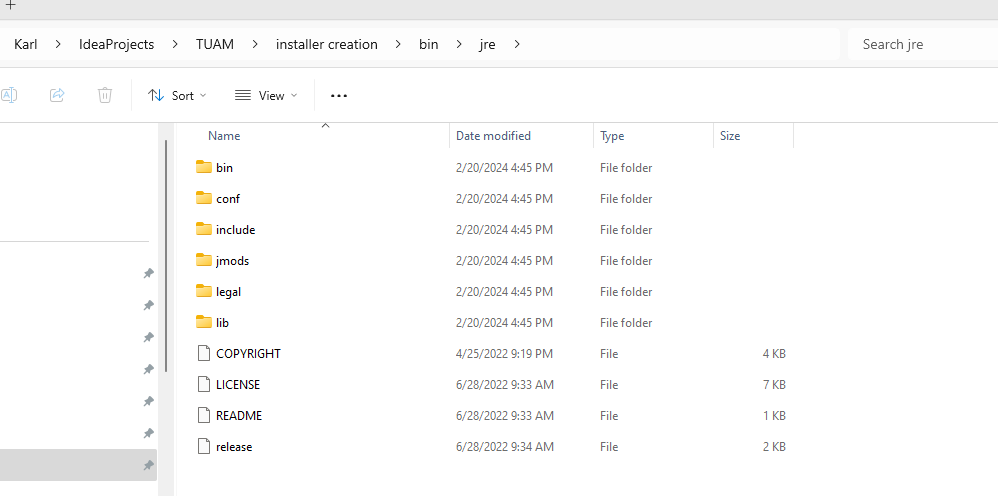
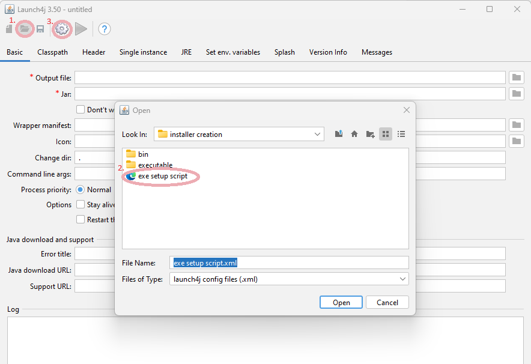
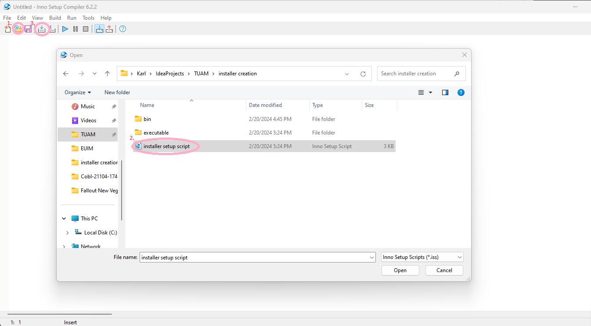

## NB! Versions can change or be overlooked when releasing new versions,make sure you check line 12 `<version>0.5.0</version>` in the file [pom.xml](pom.xml)
### This version need to match the versions present in the following files:
* [jar to exe setup script file](installer creation/exe setup script.xml)
* [windows installer setup file](installer creation/installer setup script.iss)

## Requirements
   * Java 17
   * JAVA_HOME environment variable set
   * Inno setup compiler 6.2.2
   * Launch4J 3.50
   * NPM
   * Node JS
## JRE to project folder
1. Download jdk-17.0.3.1 from https://www.oracle.com/java/technologies/javase/jdk17-archive-downloads.html
    * Download the Windows x64 Compressed Archive variant
    * Extract the package and copy the inside of the jdk-17.0.3.1 folder to the path `installer creation/bin/jre`
    * Should look like the following image:
      
## Installer compilation guide
1. Create Jar by running the following commands in the project root folder
   * `./mvnw clean`
   * `./mvnw package`
3. Open Launch4J and press the folder icon and open "[installer creation/exe setup script.xml](installer creation/exe setup script.xml)"
3. Press the "cog" icon
   * See following image steps 1,2 and 3
   
4. Open "installer setup script.iss" with inno setup compiler
5. Press compile button
   * See following image steps 1,2 and 3
   
6. Find created installer at folder `installer creation/executable/EUIM installer.exe`
7. Run Installer

